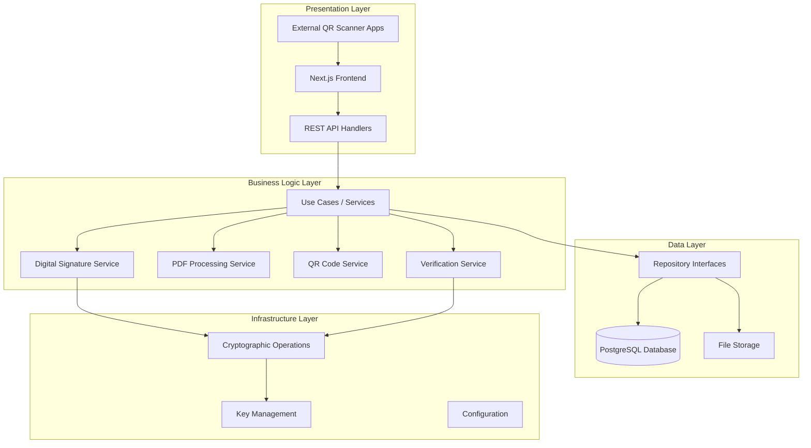

# Design Document

## Overview

The Digital Signature System is a comprehensive solution for creating, managing, and verifying digitally signed PDF documents using QR Code technology. The system employs RSA digital signatures with SHA-256 hashing to ensure document integrity and authenticity. The architecture follows a modern three-tier approach with a Next.js frontend, Golang backend, and PostgreSQL database, all containerized using Docker.

## Architecture

### Clean Architecture Overview

The system follows a simplified Clean Architecture pattern with clear separation of concerns:



### Architecture Layers

#### 1. Presentation Layer
- **Frontend**: Next.js components and pages
- **API Handlers**: HTTP request/response handling
- **Middleware**: Authentication, validation, error handling

#### 2. Business Logic Layer (Use Cases)
- **Document Service**: Core document signing and management logic
- **Verification Service**: Document verification business rules
- **PDF Service**: PDF processing and QR injection logic
- **Signature Service**: Digital signature operations

#### 3. Data Layer
- **Repository Pattern**: Abstract data access interfaces
- **Database Models**: PostgreSQL entities and relationships
- **File Storage**: PDF file storage management

#### 4. Infrastructure Layer
- **Cryptography**: RSA operations and key management
- **Configuration**: Environment and security settings
- **External Services**: Third-party integrations

### Technology Stack

- **Frontend**: Next.js 15 with TypeScript, Tailwind CSS, React Query
- **Backend**: Golang 1.22+ with Gin framework, GORM ORM
- **Database**: PostgreSQL 16
- **Containerization**: Docker & Docker Compose
- **PDF Processing**: Go libraries (unidoc/unipdf)
- **QR Code**: Go QR code generation libraries
- **Cryptography**: Go crypto/rsa, crypto/sha256

## Components and Interfaces

### Frontend Components

#### 1. Document Upload Component
```typescript
interface DocumentUploadProps {
  onUpload: (file: File) => Promise<void>;
  maxSize: number; // 50MB
  acceptedTypes: string[]; // ['application/pdf']
}
```

#### 2. Document Management Component
```typescript
interface DocumentListProps {
  documents: SignedDocument[];
  onSearch: (query: string) => void;
  onDelete: (docId: string) => void;
  pagination: PaginationConfig;
}
```

#### 3. Verification Component
```typescript
interface VerificationProps {
  documentId: string; // from URL parameter when QR is scanned
  onDocumentUpload: (file: File) => Promise<VerificationResult>;
}
```

### Clean Architecture Implementation

#### 1. Use Cases (Business Logic)
```go
// Authentication Use Cases
type AuthUseCase interface {
    Login(ctx context.Context, req LoginRequest) (*LoginResponse, error)
    Logout(ctx context.Context, userID string) error
    ValidateSession(ctx context.Context, sessionToken string) (*User, error)
    RefreshToken(ctx context.Context, refreshToken string) (*TokenResponse, error)
}

// Document Use Cases
type DocumentUseCase interface {
    SignDocument(ctx context.Context, userID string, req SignDocumentRequest) (*SignDocumentResponse, error)
    GetDocuments(ctx context.Context, userID string, req GetDocumentsRequest) (*GetDocumentsResponse, error)
    GetDocumentByID(ctx context.Context, userID string, docID string) (*Document, error)
    DeleteDocument(ctx context.Context, userID string, docID string) error
}

type VerificationUseCase interface {
    GetVerificationInfo(ctx context.Context, docID string) (*VerificationInfo, error)
    VerifyDocument(ctx context.Context, req VerifyDocumentRequest) (*VerificationResult, error)
}
```

#### 2. Repository Interfaces (Data Layer)
```go
type UserRepository interface {
    Create(ctx context.Context, user *User) error
    GetByID(ctx context.Context, id string) (*User, error)
    GetByUsername(ctx context.Context, username string) (*User, error)
    Update(ctx context.Context, user *User) error
}

type SessionRepository interface {
    Create(ctx context.Context, session *Session) error
    GetByToken(ctx context.Context, token string) (*Session, error)
    Delete(ctx context.Context, token string) error
    DeleteByUserID(ctx context.Context, userID string) error
}

type DocumentRepository interface {
    Create(ctx context.Context, doc *Document) error
    GetByID(ctx context.Context, id string) (*Document, error)
    GetByUserID(ctx context.Context, userID string, filter DocumentFilter) ([]*Document, error)
    Update(ctx context.Context, doc *Document) error
    Delete(ctx context.Context, id string) error
}

type VerificationLogRepository interface {
    Create(ctx context.Context, log *VerificationLog) error
    GetByDocumentID(ctx context.Context, docID string) ([]*VerificationLog, error)
}
```

#### 3. Services (Infrastructure Layer)
```go
type SignatureService interface {
    SignDocument(docHash []byte) (*Signature, error)
    VerifySignature(docHash []byte, signature *Signature) (bool, error)
}

type PDFService interface {
    CalculateHash(pdfData []byte) ([]byte, error)
    InjectQRCode(pdfData []byte, qrCode []byte, position Position) ([]byte, error)
    ValidatePDF(pdfData []byte) error
}

type QRCodeService interface {
    GenerateQRCode(data QRCodeData) ([]byte, error)
    ParseQRCode(qrData []byte) (*QRCodeData, error)
}
```

#### 4. API Handlers (Presentation Layer)
```go
type DocumentHandler struct {
    documentUC DocumentUseCase
    verifyUC   VerificationUseCase
}

func (h *DocumentHandler) SignDocument(c *gin.Context) {
    // Handle HTTP request/response
    // Validate input
    // Call use case
    // Return response
}

func (h *DocumentHandler) VerifyDocument(c *gin.Context) {
    // Handle verification request
    // Call verification use case
    // Return verification result
}
```

## Data Models

### Database Schema

#### Users Table
```sql
CREATE TABLE users (
    id UUID PRIMARY KEY DEFAULT gen_random_uuid(),
    username VARCHAR(100) UNIQUE NOT NULL,
    password_hash VARCHAR(255) NOT NULL,
    full_name VARCHAR(255) NOT NULL,
    email VARCHAR(255) UNIQUE NOT NULL,
    role VARCHAR(50) DEFAULT 'user',
    created_at TIMESTAMP DEFAULT CURRENT_TIMESTAMP,
    updated_at TIMESTAMP DEFAULT CURRENT_TIMESTAMP,
    is_active BOOLEAN DEFAULT true
);

CREATE INDEX idx_users_username ON users(username);
CREATE INDEX idx_users_email ON users(email);
```

#### Sessions Table
```sql
CREATE TABLE sessions (
    id UUID PRIMARY KEY DEFAULT gen_random_uuid(),
    user_id UUID REFERENCES users(id) ON DELETE CASCADE,
    session_token VARCHAR(255) UNIQUE NOT NULL,
    refresh_token VARCHAR(255) UNIQUE NOT NULL,
    expires_at TIMESTAMP NOT NULL,
    created_at TIMESTAMP DEFAULT CURRENT_TIMESTAMP,
    last_accessed TIMESTAMP DEFAULT CURRENT_TIMESTAMP
);

CREATE INDEX idx_sessions_token ON sessions(session_token);
CREATE INDEX idx_sessions_user_id ON sessions(user_id);
```

#### Documents Table
```sql
CREATE TABLE documents (
    id UUID PRIMARY KEY DEFAULT gen_random_uuid(),
    user_id UUID REFERENCES users(id) ON DELETE CASCADE,
    filename VARCHAR(255) NOT NULL,
    issuer VARCHAR(255) NOT NULL,
    document_hash VARCHAR(64) NOT NULL,
    signature_data TEXT NOT NULL,
    qr_code_data TEXT NOT NULL,
    created_at TIMESTAMP DEFAULT CURRENT_TIMESTAMP,
    updated_at TIMESTAMP DEFAULT CURRENT_TIMESTAMP,
    file_size BIGINT NOT NULL,
    status VARCHAR(50) DEFAULT 'active'
);

CREATE INDEX idx_documents_hash ON documents(document_hash);
CREATE INDEX idx_documents_user_id ON documents(user_id);
CREATE INDEX idx_documents_created_at ON documents(created_at);
```

#### Verification Logs Table
```sql
CREATE TABLE verification_logs (
    id UUID PRIMARY KEY DEFAULT gen_random_uuid(),
    document_id UUID REFERENCES documents(id),
    verification_result VARCHAR(50) NOT NULL,
    verified_at TIMESTAMP DEFAULT CURRENT_TIMESTAMP,
    verifier_ip INET,
    details JSONB
);
```

### Go Data Models

```go
type User struct {
    ID           string    `json:"id" gorm:"primaryKey;type:uuid;default:gen_random_uuid()"`
    Username     string    `json:"username" gorm:"uniqueIndex;not null"`
    PasswordHash string    `json:"-" gorm:"not null"`
    FullName     string    `json:"full_name" gorm:"not null"`
    Email        string    `json:"email" gorm:"uniqueIndex;not null"`
    Role         string    `json:"role" gorm:"default:user"`
    CreatedAt    time.Time `json:"created_at"`
    UpdatedAt    time.Time `json:"updated_at"`
    IsActive     bool      `json:"is_active" gorm:"default:true"`
}

type Session struct {
    ID           string    `json:"id" gorm:"primaryKey;type:uuid;default:gen_random_uuid()"`
    UserID       string    `json:"user_id" gorm:"not null"`
    SessionToken string    `json:"session_token" gorm:"uniqueIndex;not null"`
    RefreshToken string    `json:"refresh_token" gorm:"uniqueIndex;not null"`
    ExpiresAt    time.Time `json:"expires_at"`
    CreatedAt    time.Time `json:"created_at"`
    LastAccessed time.Time `json:"last_accessed"`
    User         User      `json:"user" gorm:"foreignKey:UserID"`
}

type Document struct {
    ID            string    `json:"id" gorm:"primaryKey;type:uuid;default:gen_random_uuid()"`
    UserID        string    `json:"user_id" gorm:"not null"`
    Filename      string    `json:"filename" gorm:"not null"`
    Issuer        string    `json:"issuer" gorm:"not null"`
    DocumentHash  string    `json:"document_hash" gorm:"not null"`
    SignatureData string    `json:"signature_data" gorm:"not null"`
    QRCodeData    string    `json:"qr_code_data" gorm:"not null"`
    CreatedAt     time.Time `json:"created_at"`
    UpdatedAt     time.Time `json:"updated_at"`
    FileSize      int64     `json:"file_size"`
    Status        string    `json:"status" gorm:"default:active"`
    User          User      `json:"user" gorm:"foreignKey:UserID"`
}

type VerificationLog struct {
    ID                 string    `json:"id" gorm:"primaryKey;type:uuid;default:gen_random_uuid()"`
    DocumentID         string    `json:"document_id"`
    VerificationResult string    `json:"verification_result"`
    VerifiedAt         time.Time `json:"verified_at"`
    VerifierIP         string    `json:"verifier_ip"`
    Details            string    `json:"details" gorm:"type:jsonb"`
    Document           Document  `json:"document" gorm:"foreignKey:DocumentID"`
}
```

## Error Handling

### Error Types and Responses

```go
type APIError struct {
    Code    string `json:"code"`
    Message string `json:"message"`
    Details string `json:"details,omitempty"`
}

const (
    ErrInvalidPDF        = "INVALID_PDF"
    ErrSignatureFailed   = "SIGNATURE_FAILED"
    ErrQRGenerationFailed = "QR_GENERATION_FAILED"
    ErrVerificationFailed = "VERIFICATION_FAILED"
    ErrDocumentNotFound  = "DOCUMENT_NOT_FOUND"
    ErrInvalidQRCode     = "INVALID_QR_CODE"
)
```

### Error Handling Strategy

1. **Input Validation**: Validate all inputs at API gateway level
2. **Graceful Degradation**: Provide fallback mechanisms for non-critical features
3. **Logging**: Comprehensive error logging with correlation IDs
4. **User-Friendly Messages**: Convert technical errors to user-understandable messages
5. **Retry Logic**: Implement exponential backoff for transient failures

## Testing Strategy

### Unit Testing
- **Coverage Target**: 85% code coverage
- **Framework**: Go testing package, testify for assertions
- **Mock Strategy**: Interface-based mocking for external dependencies

### Integration Testing
- **Database Testing**: Use test containers for PostgreSQL
- **API Testing**: End-to-end API testing with real HTTP calls
- **PDF Processing**: Test with various PDF formats and sizes

### Performance Testing
- **Load Testing**: Handle 100 concurrent document signings
- **Stress Testing**: Test with documents up to 50MB
- **Memory Testing**: Monitor memory usage during PDF processing

### Security Testing
- **Cryptographic Testing**: Verify signature generation and validation
- **Input Validation**: Test against malicious PDF files
- **Key Management**: Test key rotation and secure storage

## Performance Optimization

### Frontend Optimization
- **Code Splitting**: Lazy load verification components
- **Caching**: Implement React Query for API response caching
- **Image Optimization**: Optimize QR code display and PDF previews
- **Bundle Size**: Keep bundle size under 500KB gzipped

### Backend Optimization
- **Connection Pooling**: Configure PostgreSQL connection pool (max 20 connections)
- **Caching**: Redis cache for frequently accessed documents
- **Streaming**: Stream large PDF files instead of loading into memory
- **Goroutines**: Use worker pools for concurrent PDF processing

### Database Optimization
- **Indexing**: Strategic indexes on frequently queried columns
- **Partitioning**: Consider partitioning verification_logs by date
- **Query Optimization**: Use EXPLAIN ANALYZE for query performance
- **Connection Management**: Implement proper connection lifecycle

## Security Architecture

### Cryptographic Design
- **Algorithm**: RSA-2048 with SHA-256 for digital signatures
- **Key Management**: Environment-based key storage with rotation capability
- **Hash Function**: SHA-256 for document integrity verification
- **QR Code Security**: Include timestamp and nonce to prevent replay attacks

### Security Measures
1. **Key Storage**: Private keys stored in encrypted environment variables
2. **Access Control**: Role-based access control for administrative functions
3. **Input Sanitization**: Comprehensive input validation and sanitization
4. **Rate Limiting**: API rate limiting to prevent abuse
5. **Audit Logging**: Complete audit trail for all operations
6. **HTTPS Only**: All communications over TLS 1.3

### Threat Mitigation
- **Document Tampering**: Hash-based integrity verification
- **Signature Forgery**: RSA digital signature validation
- **Replay Attacks**: Timestamp validation in QR codes
- **DoS Attacks**: Rate limiting and resource quotas
- **Data Breaches**: Encryption at rest and in transit

## Deployment Architecture

### Docker Configuration

#### Frontend Container
```dockerfile
FROM node:20-alpine
WORKDIR /app
COPY package*.json ./
RUN npm ci --only=production
COPY . .
RUN npm run build
EXPOSE 3000
CMD ["npm", "start"]
```

#### Backend Container
```dockerfile
FROM golang:1.22-alpine AS builder
WORKDIR /app
COPY go.mod go.sum ./
RUN go mod download
COPY . .
RUN go build -o main .

FROM alpine:latest
RUN apk --no-cache add ca-certificates
WORKDIR /root/
COPY --from=builder /app/main .
EXPOSE 8000
CMD ["./main"]
```

### Docker Compose Configuration
```yaml
version: '3.8'
services:
  frontend:
    build: ./frontend
    ports:
      - "3000:3000"
    environment:
      - NEXT_PUBLIC_API_URL=http://backend:8000
    depends_on:
      - backend

  backend:
    build: ./backend
    ports:
      - "8000:8000"
    environment:
      - DB_HOST=postgres
      - DB_PORT=5432
      - DB_NAME=digital_signature
      - DB_USER=postgres
      - DB_PASSWORD=password
      - PRIVATE_KEY=${PRIVATE_KEY}
      - PUBLIC_KEY=${PUBLIC_KEY}
    depends_on:
      - postgres

  postgres:
    image: postgres:16-alpine
    environment:
      - POSTGRES_DB=digital_signature
      - POSTGRES_USER=postgres
      - POSTGRES_PASSWORD=password
    volumes:
      - postgres_data:/var/lib/postgresql/data
    ports:
      - "5432:5432"

volumes:
  postgres_data:
```

### Environment Configuration
- **Development**: Local development with hot reload
- **Staging**: Docker-based staging environment
- **Production**: Orchestrated deployment with health checks and monitoring

This design provides a robust, secure, and scalable foundation for the digital signature system while addressing all requirements including performance optimization, security, and deployment considerations.